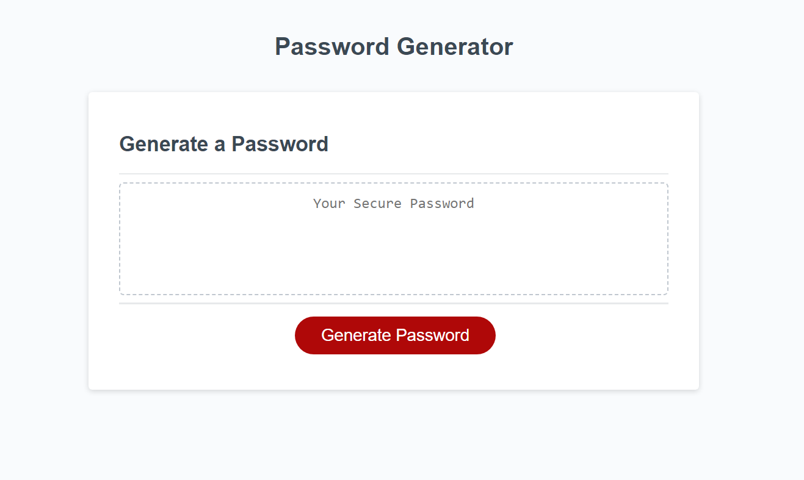

# Code Refactor Starter Code

## Description

The intent of this project is to have a password generator that will allow a variety of character types.

The user has the option to pick length between 8 and 128 characters.
If this option is not selected it will default to a length of 16 characters.

The user also has the option to select character types.
The user can effectively opt out by choosing just length as an initial choice.
The user can say yes / no to uppercase, lowercase, numbers, symbols.
If all of these options are declined then the program will randomly decide on each category.
This will also be the case if just length was chosen in the intial choice.
If the random choices result in none of the four categories being chosen it will try again (at least one type has to be employed).

What I learned from this project is how to utilize functions in JavaScript.
I also learned that 'non-answer-variables' do not seem to be able to be passed as parameters to a different function.
I made a work around for this - as noted in the commented code - but will investigate further.

## Installation

Repository location:        https://github.com/harrymac1972/password_generator.git

In Git Bash please type:
    <strong>git clone git@github.com:harrymac1972/password_generator.git</strong>
once in your folder of choice

## Usage

## Credits

Resources:

    https://www.w3schools.com/js/js_functions.asp

    https://www.w3schools.com/js/js_random.asp

